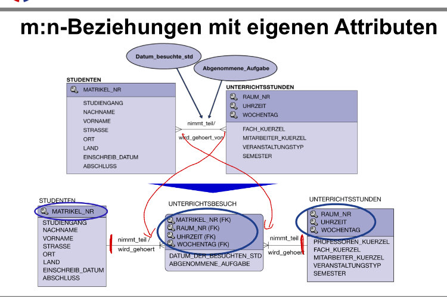
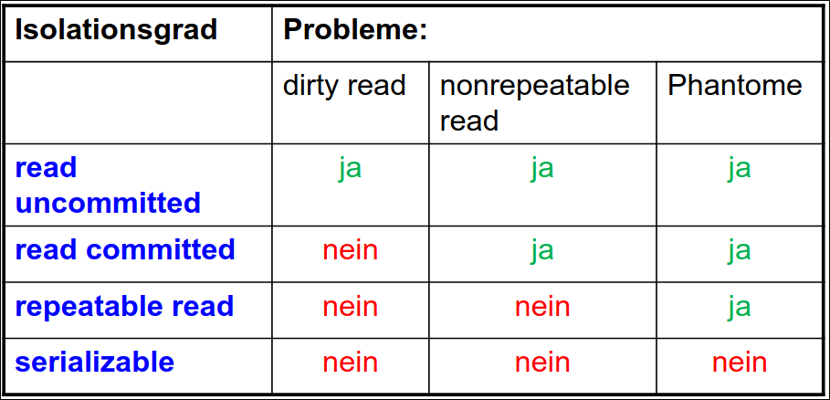

# Datenbanken

## 1. Begriffe
* SQL(Structured Query Language)
* DDL(Data Definition Language): Besteht aus SQL Befehlen die genutzt werden für Definition, Altering, Deleting.
* DCL(Data Control Language): Teil einer Datenbanksprache, der verwendet wird, um Berechtigungen zu vergeben oder zu entziehen.
* DML(Data Modeling Language): Sprache oder Sprachteile für das Abfragen, Einfügen, Ändern oder Löschen von Nutzdaten.
* Attribut -> Spaltenüberschrift
* Relationenschemata -> Ein Relationenschema R(A1, ...), bezeichnet eine Menge von Attributen.
* Relation -> Tabelle
* Mutating-Table-Problem: In Row-Triggern kein Zugriff auf die Tabelle,
für die der Trigger definiert ist.


### 2.1. ER-Modell
* Es kann aus dem DB-Schema nicht mehr eindeutig das ER-Modell ermittelt werden.



<div style="page-break-after: always"></div>

## 2. SQL
### 2.1. Basic Syntax
#### 2.1.1. SELECT
* COUNT() Anzahl der Zeilen in einer Spalte
* SUM() Summe der Werte in einer Spalte
* AVG() Mittelwert der Spalte
* MAX() größter Wert der Spalte
* MIN() kleinster Wert der Spalte
* UPPER()
* LOWER()
* ALL(<sub-query>) Bei "ALL" muss die Bedingung für alle Ergebnisse der Unterabfrage wahr sein.
* ANY(<sub-query>) Bei "ANY" muss die Bedingung für mindestens ein Ergebnis der Unterabfrage wahr sein.
* DISTINCT werden nur einmal berücksichtigt
* NULL- Werte werden bei den Gruppenfunktionen nicht berücksichtigt.
```sql
SELECT COUNT(*) ...
SELECT COUNT(DISTINCT Gehalt) ...
SELECT DISTINCT Name ...
SELECT Name, Vorname ...
SELECT Vorname || Nachname ...
SELECT Gehalt - Netto ...
SELECT 'Name:', Name
```
#### 2.1.2. FROM
```sql
FROM Kunden
FROM Kunden k --Als Alias k 
FROM Teile JOIN Artikel ON Teile.id = Artikel.id
```
#### 2.1.3. WHERE
* Gruppenfunktionen können im WHERE-Ausdruck nicht verwendet werden! -> HAVING
```sql
WHERE Konto.name = 'Thomas'
WHERE NOT Country = 'Spain';
WHERE Abt.id = Mitab.id
WHERE Abt.id = Mitab.id AND Konto.k_nr = 2
WHERE Abzuege > Gehalt * 0.4
WHERE TelNr <> '1234/34534654' --Not equal to
```
##### LIKE-Anweisung
* % ein oder mehrere Zeichen
* _ genau ein Zeichen
```sql
WHERE Nachname LIKE 'W%';
```
##### IN-Anweisung
* Die Menge nach "IN" enthält Konstanten oder eine Unterabfrage.
* Alle Konstanten haben den gleichen Datentyp.
* Die Menge darf nicht zwei gleiche Konstanten enthalten.
```sql
WHERE Kunden IN ('Köln', 'Gummersbach');
```
##### IS-NULL-Anweisung
```sql
WHERE <coln> IS NULL;
```
##### BETWEEN-Anweisung
```sql
WHERE Gehalt BETWEEN 3000 AND 6000;
```
##### EXISTS-Anweisung
* Die EXISTS-Bedingung ist wahr, wenn die Unterabfrage mindestens eine Zeile liefert.
```sql
WHERE EXISTS (SELECT ProductName FROM Products WHERE Products.supplierID = Suppliers.supplierID AND Price < 20); 
```

<div style="page-break-after: always"></div>

#### 2.1.4. GROUP-BY
* wird verwendet, um identische Daten anhand einer oder mehrerer Spalten in Gruppen zu ordnen.
* Es können im Select-Statement nur Attribute verwendet werden, die auch im Group-By-Statement vorkommen.
* häufig mit Gruppenfunktionen wie COUNT(), SUM(), ... verwendet, um Berechnungen für jede Datengruppe durchzuführen.
```sql
SELECT Student, SUM(Score)
FROM Marks
GROUP BY Student
HAVING SUM(Score) > 70;
```
#### 2.1.5. HAVING
* Filtert die Daten nach GROUP BY.
* Hier können Gruppenfunktionen genutzt werden.
```sql
HAVING SUM(Score) > 70
```
#### 2.1.6. ORDER-BY
Sortieren nach Spalte
```sql
ORDER BY Verkaufspreis [ASC | DESC]
-- Wenn zwei Verkauspreise gleich dann nach artikeltyp sortieren
ORDER BY Verkaufspreis, artikel_typ
```
#### 2.1.5 GROUP-BY / HAVING
* Ausgabe wird über die GROUP-BY-Spalten aufsteigend sortiert.
### 2.2. Fehler-Handling
#### 2.3.1. IMMEDIATE
Alle Befehle werden ausgeführt, wenn ein Fehler auftritt wird nur dieser Befehl nicht ausgeführt.
#### 2.3.2. DEFERRED
Die Befehle werden erst beim COMMIT ausgeführt, bei auftritt eines Fehlers wird ein ROLLBACK durchgeführt.
### 2.3. CONSTRAINTS
* NULL / NOT NULL (Spalte muss reale Werte enthalten)
* DEFAULT <value> (Wenn bei INSERT INTO der Wert nicht agegeben wird)
* UNIQUE KEY (keine Duplikate)
* PRIMARY KEY (UNIQUE KEY + NOT NULL)
* FOREIGN KEY (Referenziert einen PK einer anderen Tabelle.)
* CHECK (Einfache Bedingungen)
* ... ON DELETE CASCADE (Here the parent tables are Student and Course whereas the child table is Enroll. If a student drops from the course or a course is removed from the offering list it must affect the child table also.)

```sql
CREATE TABLE test(
    Typ  NUMBER(5)      NOT NULL,
    
    Typ2 VARCHAR2(10)
    CONSTRAINT <contr-name> NOT NULL,
    
    -- CONSTRAINT wird mit einer id erstellt
    Typ3 VARCHAR2(3) CONSTRAINT contr1 REFERENCES test2(Typ0)
    -- ODER
    Typ3 VARCHAR2(3),
    CONSTRAINT contr1 FOREIGN KEY (Typ3, [...]) REFERENCES test2(Typ0),
    
    -- CONSTRAINT wird 'anonym' erstellt.
    Typ3 VARCHAR2(3) REFERENCES test2(Typ0)
    -- ODER
    Typ3 VARCHAR2(3),
    FOREIGN KEY (Typ3, [...]) REFERENCES test2(Typ0),
);
```

```sql
-- Foreign Key Contraint kann auch nach CREATE-Anweisung mit ALTER Table hinzugefügt werden.
ALTER TABLE <table-name> 
ADD CONSTRAINT <contr-name> FORAIGN KEY (<pr-key>, [...])
REFERENCES <table-name>(<spalte-1>, [...]);
```

<div style="page-break-after: always"></div>

```sql
CREATE TABLE Enroll (
    sno INT,
    cno INT,
    jdate date,
    PRIMARY KEY(sno,cno),
    FOREIGN KEY(sno) 
        REFERENCES Student(sno)
        ON DELETE CASCADE
    FOREIGN KEY(cno) 
        REFERENCES Course(cno)
        ON DELETE CASCADE
);
```


### 2.4. DROP-Anweisung
```sql
DROP TABLE <name>;
DROP TABLE <name> CASCADE CONSTRAINT; -- Deletes all foreign keys that reference the table to be dropped, then drops the table
```
### 2.5. DELETE-FROM-Anweisung
```sql
DELETE FROM <table-name>
WHERE <Bedingung>

DELETE FROM <table-name>
```
### 2.6. ALTER-Anweisung
```sql
-- Spalten Bearbeiten
ALTER TABLE <name> ADD (<Spalten-name>  <data-type>)
ALTER TABLE <name> DROP (<Spalten-name>)

-- Constraints Bearbeiten
ALTER TABLE <name> ADD CONSTRAINT <cstr-name> ...
ALTER TABLE <name> DROP CONSTRAINT <cstr-name> 
```

<div style="page-break-after: always"></div>

### 2.7. INSERT-Anweisung
```sql
-- Angabe aller Spalten
INSERT INTO <table-name>
VALUES (...);

-- Spalten können hier auch weggelassen werden (diese werden NULL gesetzt)
INSERT INTO <table-name> (spalte-1, ...)
VALUES (...);

-- Oder aus anderer Tabelle
INSERT INTO <table-name> (spalte-1, ...)
    SELECT [DISTINCT] spalte-1 [, ...]
    FROM ...
    WHERE ...
```
### 2.8. UPDATE-Anweisung
```sql
UPDATE <table-name> 
SET <table-column> = 100 --or SET <table-column> = <table-column> * 100
WHERE <table-column> = 5;

UPDATE <table-name>
SET Zeitstempel = SYSDATE;
```
### 2.9. RENAME-Anweisung
```sql
RENAME <old-table-name> TO <new-table-name>;
```
### 2.10. CREATE-Table-Anweisung
```sql
CREATE TABLE <table-name>(
    <attr-name> <type>,
    ...
);
```
### 2.11. CREATE-INDEX-Anweisung
```sql
CREATE [UNIQUE] INDEX
<index-name> ON <table-name>
(<column-name> [, <column-name> ...] )
```
#### 2.9.1. Regeln bei Indices
* Die Spalte wird häufig als Suchbedingung in Abfragen verwendet.
* Die Spalte wird häufig als Join-Bedingung zur Verbindung unterschiedlicher Tabellen verwendet.
* Die Spalte enthält einen großen Bereich an unterschiedlichen Werten (hohe Selektivität).
* Die Tabelle hat viele Tupel.
* Die Spalte gehört nicht zum Primärschlüssel.
### 2.12. CREATE-SEQUENCE-Anweisung
```sql
CREATE SEQUENCE <seq-name>
    INCREMENT BY <number>
    START WITH <number>
    MAXVALUE <number>     --or NOMAXVALUE
    MINVALUE <number>
    CYCLE / NOCYCLE
    CACHE <number>        -- caches n values

<seq-name>.NEXTVAL
<seq-name>.CURVAL

```
### 2.13. VIEWs
* View ist eine "künstliche" Tabelle, die eine SQL-Abfrage darstellt.
* Materialisierte Sicht: Ergebnistabelle wird unter einem eigenen Name dauerhaft gespeichert.
* Virtuelle Sicht: Ergebnistabelle wird unter einem eigenen Namen bereitgestellt und bei jedem Abruf erneut erstellt

```sql
CREATE VIEW <view-name> AS
SELECT ...
FROM ...
WHERE ...
```

<div style="page-break-after: always"></div>

### 2.14. GRANT-Anweisung
````sql
GRANT <Permission> 
ON <Table-name / View-name> 
TO <PUBLIC / Username>
````
Permissions 
* ALL
* SELECT
* DELETE
* UPDATE 
* UPDATE (Spalten-Name, ...)
* INSERT
### 2.15. Combine-Selects
* UNION Kombinieren von Result-Set von zwei oder mehr SELECT-Anweisungen
* MINUS Einträge von Select-1 ohne die Einträge von Select-2
* INTERSECT Schnittmenge von Select-1 und Select-2
```sql
SELECT column_name(s) FROM table1
UNION
SELECT column_name(s) FROM table2; 
```

<div style="page-break-after: always"></div>

## 3. Join Table
### 3.1 Inner-Join ⋈ (FROM A [INNER] JOIN B ON ...)
The INNER JOIN keyword only selects matching rows from both tables if the condition is met.


### 3.2. Left-Join ⟕ (FROM A LEFT JOIN B ON ...)
Die linke Tabelle wird übernommen und mit zusätzlichen Informationen aus der rechten Tabelle ergänzt.
* Returns all rows from the left table.
* Includes only matching rows from the right table.
* Non-matching rows in the right table are represented as NULL.


<div style="page-break-after: always"></div>

### 3.3. Full-Outer-Join ⟗ (FROM A FULL JOIN B ON ...)
* Retrieves all rows from both tables.
* Matches rows where conditions meet.
* Fills NULLs where no match exists.
* Combines results of LEFT JOIN + RIGHT JOIN.
* Can be used sequentially for multiple tables. 


### 3.4. Natural-Join (FROM A NATURAL JOIN B)
* Nicht Empfohlen!
* FROM <Tabelle-1>, <Tabelle-2>
* FROM <Tabelle-1> JOIN <Tabelle-2>
* Match equal columns automatically
* Kartesisches-Produkt (Jedes-mit-Jedem)
### 2.5. Theta-Join
In conditional join, the join condition can include <, >, <=, >=, ? operators in addition to the '=' operator.
### 2.6. Equi-Join
Equi Join is a type of inner join where the join condition uses the equality operator ('=') between columns.


<div style="page-break-after: always"></div>

## 4. Normalformen
### 4.1. 1.Normalform
Eine Relation R ist (1NF), wenn alle Attribute nur atomare Werte enthalten.
### 4.2. 2.Normalform
Eine Relation R mit Primärschlüssel S ist (2NF), wenn sie (1NF) ist und jedes Nicht-Schlüssel-Attribut voll funktional abhängig vom Primärschlüssel S ist.
Es gibt kein Attribut was nur von einem Teil des Primärschlüssels abhängt.
### 4.3. 3.Normalform
Eine Relation R ist 3NF, wenn sie(1NF) und (2NF) ist und kein Nicht-Schlüsselattribut transitiv abhängig von einem Schlüsselattribut ist

## 5. JDBC
### 5.1. init
```java
String url = "jdbc:oracle:thin:@//localhost:1521/xe";
try {
    Class.forName("oracle.jdbc.driver.OracleDriver");
    //Class.forName("org.mariadb.jdbc.Driver");
} catch (ClassNotFoundException e) {
    System.err.print("ClassNotFoundException: ");
    System.err.println(e.getMessage());
}

Connection con = DriverManager.getConnection(url, "chris", "xyz");
```
### 5.2. Statements
```java
Statement stat = con.createStatement();
// ALTER, CREATE, INSERT, ... (ändert werte in DB)
int changes = stat.executeUpdate("");

// SELECT ...
ResultSet rs = stat.executeQuery("");
```

<div style="page-break-after: always"></div>

### 5.3. Prepared Statements
```java
// Alle SQL Queries sind möglich.
// Platzhalter mit ?
PreparedStatement pstat = con.prepareStatement("SELECT * FROM spieler  WHERE spieler.nachname=?");

pstat.setString(1, "Uwe");
// pstat.setBlob(2, ...) | pstat.setInt(...)

// ALTER, CREATE, INSERT, ... (ändert werte in DB)
int changes = pstat.executeUpdate();

// SELECT ...
ResultSet rs = pstat.executeQuery();
```
### 5.4. Result-Set
```java
while (result.next()){
    String vname = result.getString(1); // oder .getString("nachname")
    String nname = result.getString(2);
    String fkt = result.getString(3);
    String gehInEur = result.getString(4);
    
    System.out.println("\t" + vname + " " + nname + " " + fkt + " " + gehInEur);
}
```
### 5.5. Check If Result-Set is Empty
````java
if (result.isBeforeFirst()) {
    result.next();
}
````
### 5.6. absolute
```sql
Statement statement = con.createStatement(ResultSet.TYPE_SCROLL_SENSITIVE);

ResultSet set = statement.executeQuery("SELECT * FROM ...");

set.absolute(9); // Neunte Zeile

int i = set.getInt(1);
```
## 6. Transactions

* Start of Transaction: A transaction begins when the first executable SQL statement is encountered.
* End of Transaction: COMMIT-Statement or the database issues an implicit COMMIT statement before and after every DDL (CREATE, DROP, RENAME, or ALTER) statement.

1. dirty Read: A Dirty Read in SQL occurs when a transaction reads data that has been modified by another transaction, but not yet committed.
2. Non Repeatable read: Non-repeatable read occurs when a transaction reads the same row twice and gets a different value each time.
3. Phantom Read: Phantom Read occurs when two same queries are executed, but the rows retrieved by the two, are different.

### The four standard isolation levels are: 
1. Read Uncommitted
   * Lowest level of isolation, transaction can see uncommitted changes made by other transactions.
2. Read Committed
   * a transaction can only see changes made by other committed transactions.
3. Repeatable Read
   * guarantees that a transaction will see the same data throughout its duration, even if other transactions commit changes to the data.
4. Serializable
   * write locks are acquired within a transaction and are held until the transaction commits or rolls back for both read and write operations.
   * a row that has been read by one transaction can be read, but not updated or deleted by any other transaction until the first transaction completes.
   * Similarly, a row that has been inserted, updated, or deleted by a transaction cannot be accessed in any way by any other transaction until the first transaction completes. 

